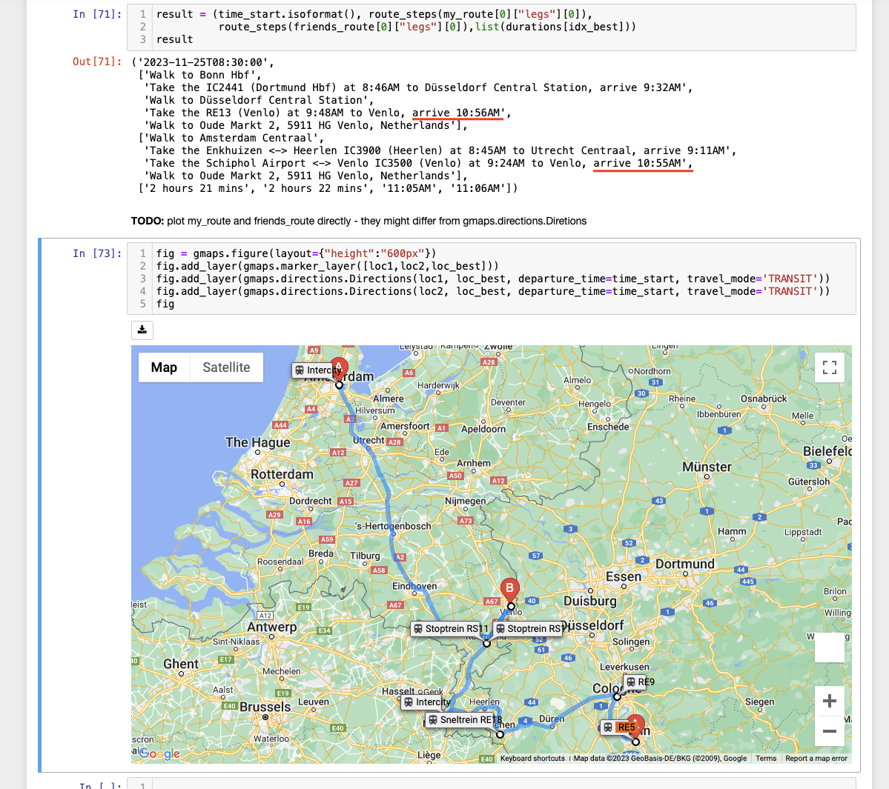

# Meet In The Middle
Your friend and you want to meet at a location that's "optimal", i.e. 
minimises both of your effort in travelling there (see below for precise 
definitions). This program calculates candidate locations and routes to 
get there using the Google Maps API. 

**Note:** To Run the script yourself, you will need to create your own 
[account](https://developers.google.com/maps/documentation/distance-matrix) 
and generate an [API 
key](https://developers.google.com/maps/documentation/distance-matrix/get-api-key). 
Also keep in mind that you cannot send arbitrarily many free requests, see 
[pricing 
info](https://developers.google.com/maps/billing-and-pricing/overview) for 
details.
